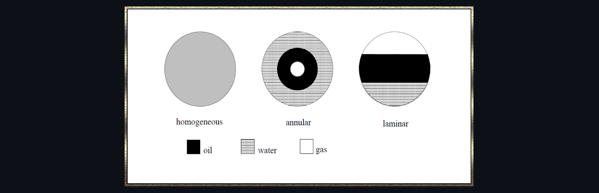

<!-- ABOUT THE PROJECT -->
## About
12-dimensional dataset from [inverseprobability](https://inverseprobability.com/3PhaseData.html) is a physics-based simulation output of a non-invasive monitoring system.
It is used to determine the quantitiy of oil in a multi-phase pipeline cotaining a mixture of oil, water and gas.

If you wish to follow along my code and want to see my in-dept comments, check out my [blog post](https://erolgelbul.com/project-blog/oil-data-classification).

Datasets include 3 classes:
* Homogenous
* Annular
* Laminar (stratified)

The training set consists of 1000 instances, 343 labeled as 1, 316 labeled as 2 and 341 labeled as 3. The set is treated as a balanced dataset. Test set is also balanced,
it has 300 instances.  Data does not require preprocessing or cleansing but it requires normalisation.

To classify the data I used Support Vector Machines (SVMs). Type of SVM: Cost-Support Vector Classifier). Kernel function used: Guassian radial basis function (RBF).

(<a href="#top">back to top</a>)

<!-- TECH -->
## Software and Libraries

IDE: [Jupyter Notebook](https://jupyter.org/) (Language: python3)

Packages: Numpy, Pandas, Matplotlib, Seaborn, Sklearn

(<a href="#top">back to top</a>)

<!-- CONTRIBUTING -->
## Contributing

If you would like to add any extra features to the optimisation simulation, feel free to fork and create a pull request. Thank you!

1. Fork the Project
2. Create your Feature Branch (`git checkout -b feature/AmazingFeature`)
3. Commit your Changes (`git commit -m 'Add some AmazingFeature'`)
4. Push to the Branch (`git push origin feature/AmazingFeature`)
5. Open a Pull Request

(<a href="#top">back to top</a>)

<!-- CONTACT -->
## Contact

Erol Gelbul - [Website](http://www.erolgelbul.com) - erolgelbul@gmail.com

Project Link: [Oil Data Classification](https://github.com/ErolGelbul/oil_data_classification)

(<a href="#top">back to top</a>)

